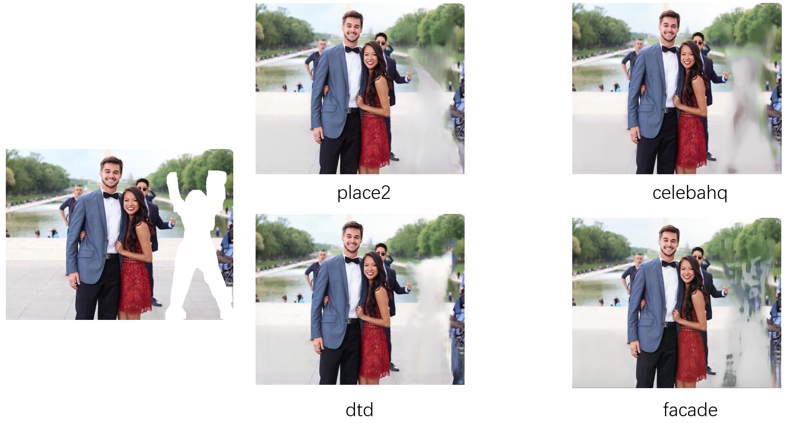

# Computational-Photography
[TOC]

 This is a course project for computer photography for 2024 Spring

## Lab

| summary                                      |                  result                  |
| -------------------------------------------- | :--------------------------------------: |
| OpenCV initialization                        |          |
| Image filtering and Fourier transformation   |                  |
| Sparse matrices and Gaussian-Sider iteration |  |
| Nonlinear least squares                      |           |
| Inpainting                                   |         |
| Panorama stitching                           |    |
| Augmented Reality                            |                   |

# Final Project

