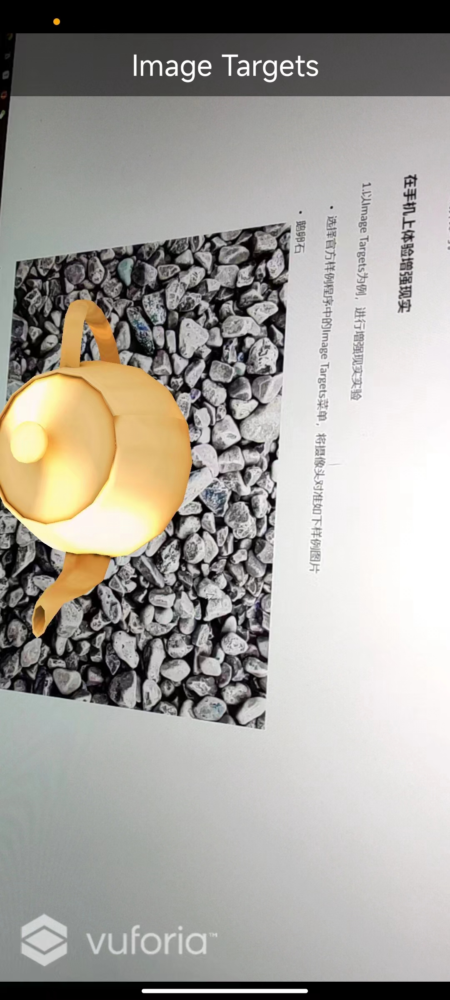
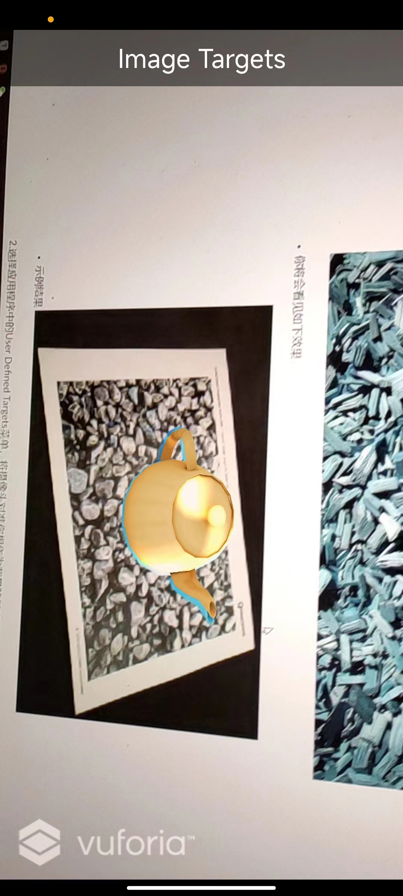
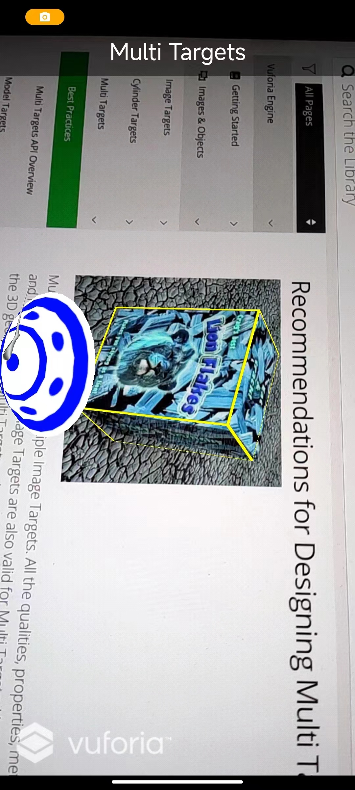
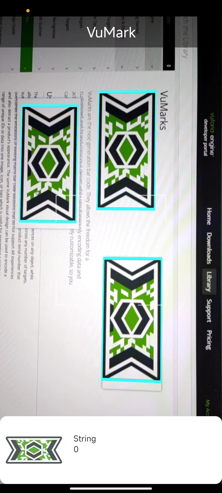
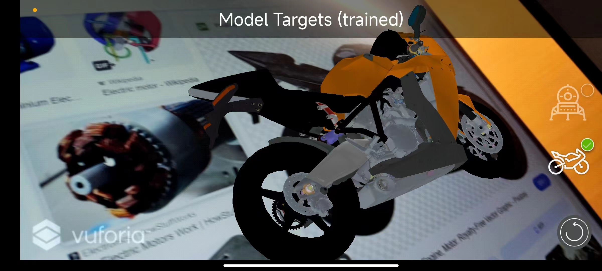
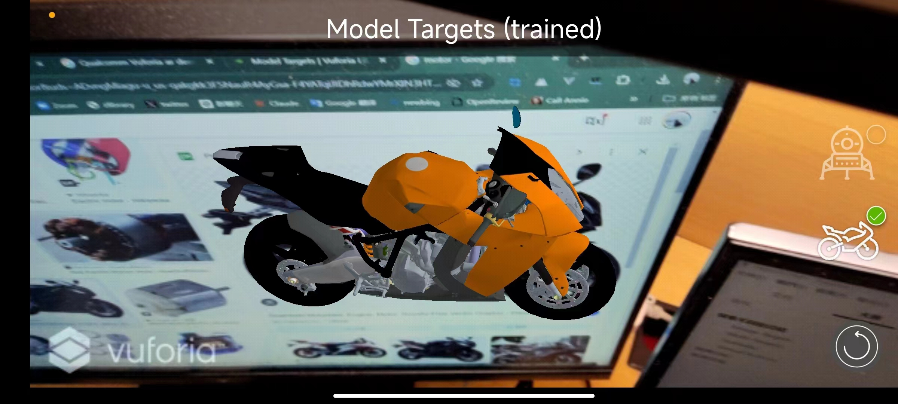
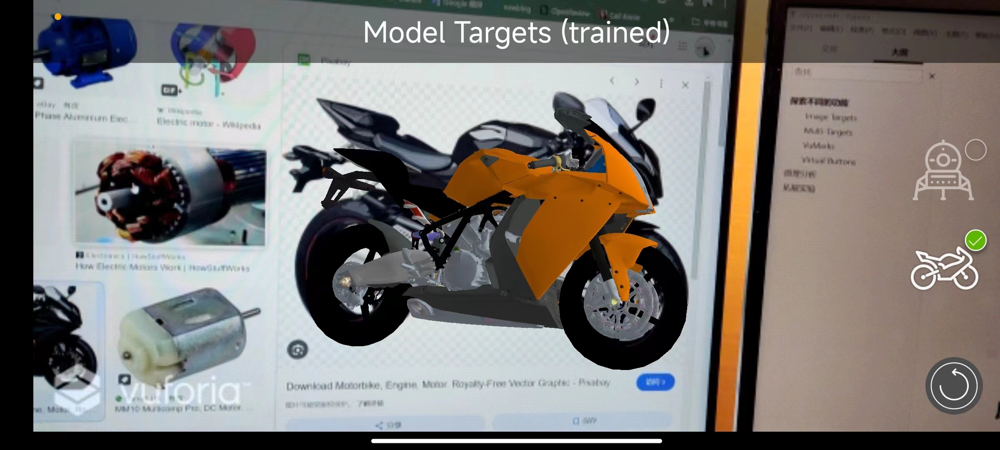
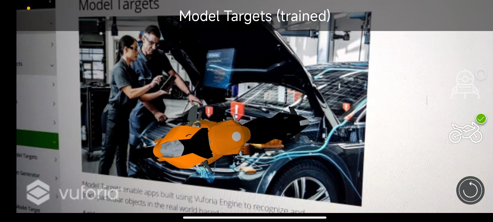

  
    增强现实
  
   

     Bonus
  
  

    姓名： 周炜
  
  

    学号： 32010103790
  

 

# 探索不同的功能

探索[Qualcomm Vuforia官方样例程](https://developer.vuforia.com/library/objects/cylinder-targets), 截图都已经呈现在了报告中

### Image Targets

Image Targets 通过将从相机图像中提取的自然特征与已知的目标资源数据库进行比对，来追踪图像。一旦检测到图像目标，Vuforia引擎将使用地跟踪图像并增强需要显示的内容。

**算法原理**：

Vuforia Engine利用从摄像头图像中提取的自然特征与已知目标资源数据库进行比较，从而实现图像的识别和跟踪。一旦图像目标被检测到，Vuforia Engine将使用图像跟踪技术来无缝地跟踪图像并增强内容

**鲁棒性与失效情况分析**：

- 光照与反射影响：根据参考资料，Image Targets受光照和反射影响，因此在过于明亮或反射光较强的环境下可能会影响跟踪效果。因此，在设计应用时需要考虑环境光照的因素，以确保最佳的跟踪体验。
- 图像特征和质量：图像的特征和质量会影响图像跟踪的稳定性和准确性。一些图像可能具有较少的特征或过于简单，导致跟踪丢失。因此，在选择或设计Image Targets时，需要注意选择具有足够特征和适当质量的图像，以提高跟踪的鲁棒性。

### Multi-Targets

**算法原理**：

Multi-Targets是将多个图像目标合并为定义的几何排列，例如盒子。这样可以从所有侧面进行跟踪和检测，并可以在例如营销、包装和教学等多种情境中发挥作用。首先，在Vuforia Target Manager中创建多目标，并上传符合多目标尺寸的图像。

多目标的使用包括识别和增强印刷媒体和产品包装，例如营销活动、游戏和在产品安装和使用环境中对产品进行可视化。

多目标的功能是所有多目标的各个面可以同时跟踪，因为它们相对于多目标的原点有一个共享的预定义姿态。这使得当检测到其任何子目标时，整个多目标都可以被跟踪。这样，多目标为其子目标提供了单一的跟踪参考。

**鲁棒性与失效情况分析**：

- 光照与反射影响：多目标应在适度明亮和光线均匀的扩散照明下观察。物体表面应该均匀照明，以确保最佳的跟踪效果。
- 图像质量与特征：图像的质量和特征会影响多目标的稳定性和跟踪准确性。如果图像质量较低或特征不足，可能会导致跟踪失败。因此，在设计多目标时，需要确保使用具有足够特征和高质量的图像，以提高跟踪的鲁棒性。

### VuMarks

**算法原理**：

VuMarks是下一代的条形码。它们允许自定义和品牌意识设计，同时编码数据并充当可跟踪的AR目标。VuMark设计完全可定制，因此您可以为每个独特的对象创建独特的VuMark。

使用VuMarks VuMark提供了在任何对象上提供独特AR体验的通用解决方案，同时允许自定义外观和感觉的设计，在任意数量的目标上保持一致。VuMarks提供了一种简单的方法来编码数据，如URL或产品序列号，克服了现有矩阵条形码解决方案的限制，这些解决方案不支持AR体验，也影响产品的外观。相同的VuMark视觉设计可以用来将一系列唯一的ID或数据编码为一个图像、图标或标志，这对于在产品范围内呈现共同标识符非常有用。

总结一下，VuMark的特点是：

- 提供数百万个独特可识别的实例。
- 编码各种数据格式。
- 根据其实例ID区分相同外观的产品。
- 在3D中持续跟踪VuMarks。

**鲁棒性与失效情况分析**：

- 光照与反射影响：VuMarks应在适度明亮且光线均匀的环境下观察。物体表面的光泽度、反射和照明设置都会影响其跟踪能力。
- 图像质量与特征：图像质量和特征会影响VuMark的稳定性和跟踪准确性。如果图像质量低下或特征不足，可能会导致跟踪失败。因此，在设计VuMark时，需要确保使用具有足够特征和高质量的图像，以提高跟踪的鲁棒性。

通过这些分析，可以了解VuMark的原理及其在不同环境下的鲁棒性和失效情况。

### Model Targets

多目标（Multi Target）是将多个图像目标组合成定义的几何排列，例如盒子。这样可以从所有侧面进行跟踪和检测，并且可以服务于许多用例，例如营销、包装以及教学环境。首先，在Vuforia目标管理器中创建多目标，并上传符合多目标尺寸的图像。

使用多目标 多目标的常见用途包括识别和增强印刷媒体和产品包装，用于营销活动、游戏和在产品安装和使用环境中对产品进行可视化。

多目标的工作方式是，多目标的所有面可以同时跟踪，因为它们相对于多目标原点具有共享的预定义姿态。当检测到其任何子目标时，这使得整个多目标都可以被跟踪。这样，多目标为其子目标提供了单一的跟踪参考。

从具体效果上看可以发现各个角度都贴合的很好

**失效情况分析：**

- 光照与反射影响：多目标最好在适度明亮和扩散光下进行观察。物体表面应该均匀照明。
- 图像质量与特征：图像的质量和特征会影响多目标的稳定性和跟踪准确性。如果图像质量较低或特征不足，可能会导致跟踪失败。因此，在设计多目标时，需要确保使用具有足够特征和高质量的图像，以提高跟踪的鲁棒性。

通过这些分析，可以了解多目标的原理及其在不同环境下的鲁棒性和失效情况。

这个是一个失败的案例，这里没有摩托车，但是还是识别上去了

