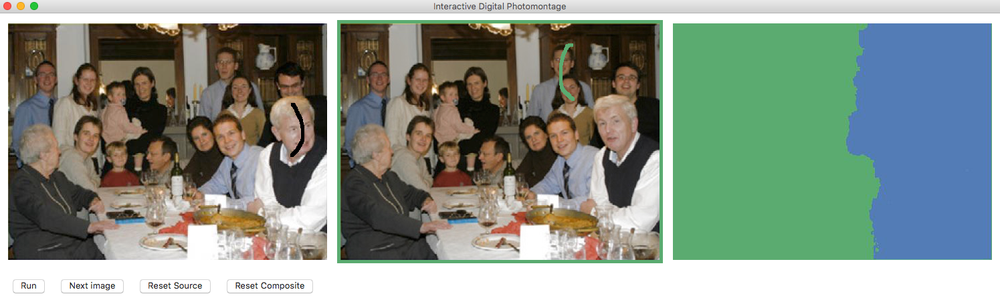

  
    深度学习图像补全
  
   

     lab 6
  
  

    姓名： 周炜
  
  

    学号： 32010103790
  

 

# Interactive Digital Photomontage

This is a very simple python Implementation of [Interactive Digital Photomontage](https://grail.cs.washington.edu/projects/photomontage/photomontage.pdf).

This implementation is far from faithful to the original paper. It only supports "Designated image" data penalty and "colors" interaction penalty, as dicussed in Section 3 of the paper. Also, for simplicity, alpha-beta swap is used in place of alpha expansion in the graph-cut stage. The way user interacts with the program is also different.

The code for poisson blending is largely borrowed from [this](https://github.com/PPPW/poisson-image-editing) repo.

## Denpendencies

The code is in Python 3. The GUI is written in tkinter, which should be shipped with most python distribution.

## Usage

使用非常简单。首先将源图像放置在`source_imgs`目录中（仅支持`.jpg`和`.jpeg`格式）。然后在命令行中运行`python main.py`，应该会出现如上所示的窗口。

左边的图像是当前的合成图像。中间的图像是源图像之一。您可以点击"下一张图像"来切换到下一个源图像。右边的地图是标签地图，指示合成图像的哪个部分来自哪个源图像。

此实现将当前的合成图像逐个与一个源图像混合。您只需在合成图像和源图像上分别绘制几笔，表示您想要保留的合成部分和源图像部分。然后点击"运行"按钮，等待几秒钟。新的合成图像将在左侧生成，右侧是标签地图。这两个图像将保存在`output_imgs`目录中。

# todo:

1. 支持格式png
2. `posion.py`是第三部分拼接，主文件中是算法。对照着先把报告写完
3. 把交互界面改一下，可以尝试Gradio或者用QT，反正改一改。
4. 把最后一项bonus做一下

大程项目已经布置：http://www.cad.zju.edu.cn/home/gfzhang/course/computational-photography/projects.html，

源代码和项目报告提交截止时间：暂定为 2024年6月16日23:59

# 作业要求

这个bonus的要求要低很多

http://www.cad.zju.edu.cn/home/gfzhang/course/computational-photography/proj3-mantage/mantage.html

参考的C++作业 https://github.com/dmortem/Interactive-Digital-Photomontage?tab=readme-ov-file

参考的python https://github.com/jiahaoli95/interactive-photomontage
