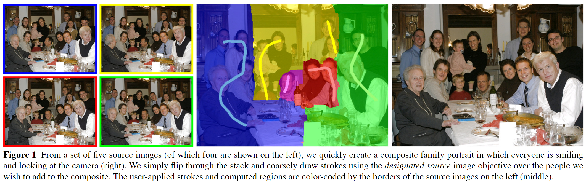
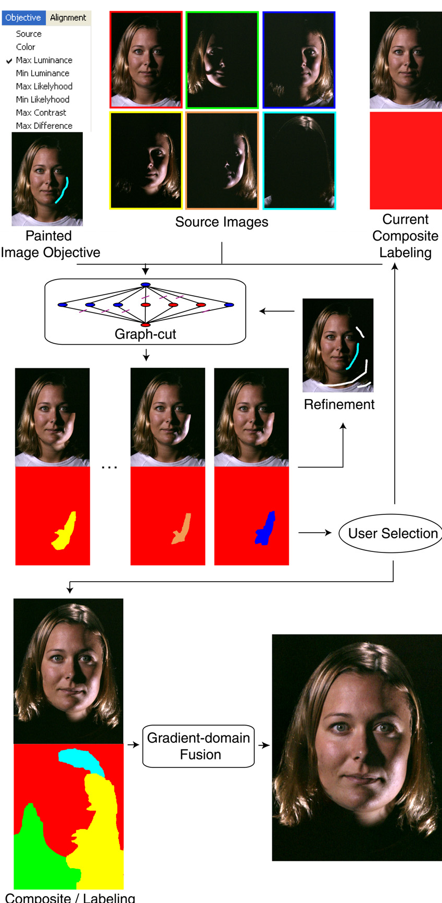
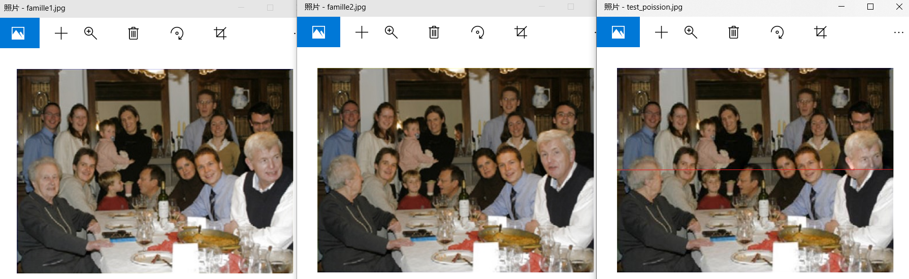
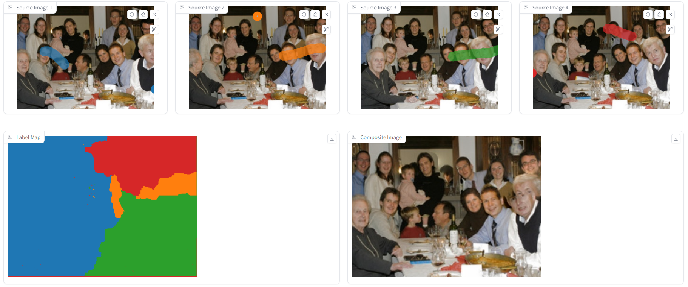

<center>
  <font face="黑体" size = 6>
    交互式数字蒙太奇
  </font>
  <center><font face="黑体" size = 4>
    姓名： 周炜
  </font>
  <center><font face="黑体" size = 4>
    学号： 3210103790
  </font>
</center> 

[TOC]

## 一、 交互式数字蒙太奇效果概述

交互式数字蒙太奇是一种创新的图像处理技术，最早在论文 [[1]]((https://grail.cs.washington.edu/projects/photomontage/photomontage.pdf)) 中被引入。该技术可以以一种难以察觉的方式将多张照片融合在一起，从而产生令人惊叹的真实图像融合效果。

在交互式数字蒙太奇中，系统通过用户的输入和画笔操作，将标签(label)应用到每张照片上。用户可以使用画笔在照片上标记感兴趣的区域，指定不同的标签。系统根据这些用户指定的标签以及图像中的颜色信息，来生成最终的融合结果。

例如，考虑下图中的示例。左侧展示了四张不同的照片，而中间的图像显示了用户进行人工交互的结果，即用户用画笔在每张照片上标记了不同的区域。通过结合用户标记的标签和每个区域的颜色信息，系统生成了右侧展示的融合效果。这种技术可以产生逼真的图像融合，使得多张照片以一种无缝、自然的方式融合在一起。

交互式数字蒙太奇技术的应用非常广泛，例如在数字艺术、虚拟现实、视频制作等领域都有重要的应用。它使用户能够以交互的方式参与到图像融合的过程中，从而实现更加个性化和精确的图像合成。该技术的发展为我们提供了创造出更具创意和逼真度的图像融合效果的机会。本课程作业主要对该技术进行了实现。

## 二、算法原理与实现

### 2.1 算法流程

整个算法的流程大致如下图所示：



最初，第一张源图像被用作当前的合成图像，并进行标记（标记显示在合成图像下方）。初始时，标记在整个图像上保持恒定，因为合成图像的所有像素都来自同一张源图像。然后，用户通过使用单图像画笔以不同的图像目标进行迭代绘画，修改当前的合成图像和标记。最后，应用梯度域融合以消除任何剩余可见的接缝。

要实现上述的两个功能，包含两个重要的技术**Graph-cut optimization**和**Gradient-domain fusion**， 也就是论文中的第3和第4节的内容，下列我讲将进行简单的介绍并且谈一谈我的理解。

### 2.2 总能量函数

对于输入图像，为了得到合成的图像，参考原论文，我们先定义本实验中需要优化的能量函数。

假设我们有$n$个源图像$S_1, ..., S_n$。为了形成一个合成图像，我们必须为每个像素$p$选择一个源图像$S_i$。我们将像素和源图像之间的映射称为标记(labeling)，并用$L(p)$表示每个像素的标记。如果在合成图像中相邻的像素$p$和$q$具有不同的标记，我们称之为接缝(seam)。

原论文中使用**"alpha expansion"算法**来最小化成本函数。**"alpha expansion"算法**的内部循环的第$t$次迭代将特定的标记$α$和当前的标记$L_t$作为输入，并计算一个最优标记$L_{t+1}$，使得$L_{t+1}(p) = L_t(p)$或$L_{t+1}(p) = α$。外部循环遍历每个可能的标记。当对所有标记进行的一次迭代无法减少成本函数时，算法终止。如果成本函数是一个度量函数，那么计算得到的标记保证在全局最小值的两倍范围内。

在我们的情况下，我们将像素标记L的成本函数$C$定义为两个项的总和：对所有像素$p$的数据惩罚项$C_d$和对所有相邻像素$p$、$q$对的交互惩罚项$C_i$：
$$
C(L) = \sum\limits_p^{} {{C_d}(p,L(p))}  + \sum\limits_{p,q}^{} {{C_i}(p,q,L(p),L(q))}
$$
其中$C_d(p)$表示像素$p$的数据惩罚，$C_i(p, q)$表示相邻像素$p$和$q$之间的交互惩罚。

对于我们的应用程序，比较重要的概念是**data term** 和 **smooth term**。数据惩罚由与图像目标的距离定义，而交互惩罚由与接缝目标的距离定义。具体而言，我们按照用户选择的方式来定义数据惩罚项$C_d(p, L(p))$，如下所示：

- 指定颜色 **Designated color (most or least similar)**：源图像像素$S_{L(p)} (p)$在RGB空间中与用户指定的目标颜色之间的欧氏距离。我们提供了一个用户界面，用于选择用作颜色目标的像素。
- 亮度 **Minimum (maximum) luminance**：与像素范围中最小（最大）亮度像素的亮度差距。
- 可能性 **Minimum (maximum) likelihood**：给定从像素范围中的所有像素的颜色直方图形成的概率分布函数，计算源图像像素$S_{L(p)} (p)$的颜色的概率（或概率的补）。颜色直方图针对三个颜色通道分别进行直方图化，使用$20$个区间进行划分，并将它们视为独立的随机变量。
- 橡皮擦：源图像像素$S_{L(p)} (p)$在RGB空间中与当前合成颜色之间的欧氏距离。
- 差异：源图像像素$S_{L(p)} (p)$与用户指定的源图像$S_u$的像素$S_u(p)$之间在RGB空间中的欧氏距离。
- 指定图像：如果$L(p) = u$，其中$S_u$是用户指定的源图像，则为$0$；否则为一个较大的惩罚。
- 对比度：通过从不同尺度计算的两个高斯模糊核的卷积相减得到的度量。

最终我们可以得到如下的数据项和平滑项的定义。

我们将接缝目标定义为如果$L(p) = L(q)$，则为0。否则，我们将目标定义为：

data term的定义如下：
$$
{C_d}(p,L(p)) = \left\{ {\begin{array}{*{20}{c}}
0&{L(p) = u}\\
{\text{large penalty}}&\text{otherwise}
\end{array}} \right.
$$
smooth term的定义如下：
$$
{C_i}(p,q,L(p),L(q)) = \left\{ {\begin{array}{*{20}{c}}
X&\text{if matching "colors"}\\
Y&\text{if matching "gradients"}\\
{X + Y}&\text{if matching "colors \& gradients"}\\
{X/Z}&\text{if matching "colors \& edges"}
\end{array}} \right.
$$
其中
$$
X=||S_{L(p)}(p)-S_{L(q)}(p)|| + ||S_{L(p)}(q)-S_{L(q)}(q)|| \\
Y=||\nabla S_{L(p)}(p)- \nabla S_{L(q)}(p)|| + ||\nabla S_{L(p)}(q)- \nabla S_{L(q)}(q)|| \\
Z=E_{L(p)}(p,q) + E_{L(q)}(p,q)
$$
其中$∇S_z(p)$是图像z在像素p处的6分量颜色梯度，$E_z(p, q)$是图像$z$的两个相邻像素$p$和$q$之间的边缘势能，使用Sobel滤波器计算而得。

需要注意的是，所有这些接缝目标都是度量函数，除了$X/Z$，它是一个半度量函数，因为它并不总是满足三角不等式。当使用这种接缝惩罚时，许多"alpha expansion"算法的理论保证都会丧失。

最后，前一节中描述的"惯性"控制是通过计算近似欧氏距离图$D(p)$来实现的，该图描述了每个点$p$处离绘制区域的距离（该距离在区域内为0）。在图割优化中，每当$L_{t+1}(p)  = L_t(p)$时，这个距离的加权版本将被添加到被最小化的整体成本函数中。惯性越高，图割在远离绘制区域的区域选择新标签的可能性就越小。

### 2.3 Graph-cut Optimization

#### 2.3.1 Markov Random Field

已经知道了上述的能量函数之后，我们的目标是优化（即最小化）上述的函数，从而求出最佳的解（在本实验中解即是每个像素的label）。求解能量函数本质是马尔可夫随机场问题（Markov Random Field），即MRF问题，它是一种用于建模和解决概率图模型中的优化问题的方法。在给定一组观测值的情况下，MRF用于估计未观测到的变量的状态。

为了解决这个优化问题，文本中提到使用了图割（graph cut）优化方法。图割是一种在图上进行优化的技术，它通过将图划分为两个部分来最小化切割成本。在这个场景下，图的节点表示像素，边表示像素之间的关系，通过最小化能量函数来获得最优的切割，即每个像素的最优标签。

课程项目介绍的页面中，助教推荐了使用[gco-v3.0库](http://vision.csd.uwo.ca/code/gco-v3.0.zip), 但是我当时这个库死活和本地的环境冲突，我最后采用了python来进行实现，我没有找到gco的python版本，最后选择采用了ICCC2005中的论文[Efficiently Solving Dynamic Markov Random Fields Using Graph Cuts.](https://ieeexplore.ieee.org/abstract/document/1544820/)的方法进行求解MRF问题, 具体来说该方法已经实现在了python的`maxflow`库中。

在图割阶段，我们使用了"指定图像"数据惩罚和"颜色"交互惩罚。并且，我使用了alpha-beta交换代替了原有论文中提到的alpha扩展。具体实现在`mantage.py`文件中的`alpha_beta_swap`函数，具体的解析如下。

函数首先获取composite图像的高度（h）和宽度（w），并初始化一个最大流图（graph），用于存储节点和边。图的节点数量为h * w，边的数量为2 * ((h - 1) * w + (w - 1) * h)，这样确保有足够的空间来存储节点和边。我们随后在该图中引入数据项和平滑项约束。

```python
def alpha_beta_swap(composite, source, composite_mask, source_mask):
    '''
    Perform alpha-beta swap maxflow for the current composite and source images.

    Args:
        composite (np.ndarray): The composite image.
        source (np.ndarray): The source image.
        composite_mask (np.ndarray): The mask for the composite image.
        source_mask (np.ndarray): The mask for the source image.

    Returns:
        np.ndarray: The label map after the alpha-beta swap.
    '''
    h, w, _ = composite.shape
    graph = maxflow.Graph[int](h * w, 2 * ((h - 1) * w + (w - 1) * h))
    nodeids = graph.add_grid_nodes((h, w))
```

#### 2.3.2 Smooth Term

smooth term用于度量相邻像素之间标签不一致的惩罚。平滑项惩罚用于保证相邻像素之间的标签一致性，避免过大的标签跳变，从而得到更平滑的分割结果.根据给定的公式我们可以解释为：

- 如果相邻像素p和q的颜色匹配，惩罚为X。
- 如果相邻像素p和q的梯度匹配，惩罚为Y。
- 如果颜色和梯度都匹配，惩罚为X + Y。
- 如果颜色和边缘匹配，惩罚为X / Z。

具体的代码实现如下：

```python
# Calculate the color differences between adjacent pixels for n-links
color_diff_x = np.sum(np.abs(composite[:, :-1] - source[:, 1:]), axis=-1)
color_diff_y = np.sum(np.abs(composite[:-1, :] - source[1:, :]), axis=-1)

# Add edges for horizontally adjacent pixels
horizontal_structure = np.array([[0, 0, 0],
                                 [0, 0, 1],
                                 [0, 0, 0]])
graph.add_grid_edges(nodeids[:, :-1], color_diff_x, horizontal_structure, symmetric=True)

# Add edges for vertically adjacent pixels
vertical_structure = np.array([[0, 0, 0],
                               [0, 0, 0],
                               [0, 1, 0]])
graph.add_grid_edges(nodeids[:-1, :], color_diff_y, vertical_structure, symmetric=True)
```

- `color_diff_x` 和 `color_diff_y` 分别计算水平和垂直方向上相邻像素的颜色差异，用于定义n-links的容量。
- `add_grid_edges` 方法用于在图中添加水平和垂直相邻像素之间的边，表示平滑项。

#### 2.3.3 Data Term

data term用于度量每个像素属于某个标签（在这里是composite或source）的适合度。数据项惩罚用于保证每个像素更符合它所属的掩码（source或composite）。根据给定的公式我们知道：

- 如果像素p的标签L(p)与给定的标签u相同，则数据项惩罚为0。
- 否则，数据项惩罚是一个非常大的值。

在graph中的约束可以表示为如下代码：

```python
# Add terminal edges
# Alpha is 0 (label for composite), beta is 1 (label for source)
alpha_weight = source_mask.astype(np.int64) * scale
beta_weight = composite_mask.astype(np.int64) * scale
graph.add_grid_tedges(nodeids, alpha_weight, beta_weight)
```

- `source_mask`表示源图像的掩码，其对应的像素标签为1。如果标签为source（1），则数据项惩罚为0，乘以一个大的常数`scale`后还是0。
- `composite_mask`表示组合图像的掩码，其对应的像素标签为0。如果标签为composite（0），则数据项惩罚为0，乘以`scale`后还是0。
- 当标签不匹配时，惩罚是一个非常大的值`scale`。

通过以上两个惩罚项，算法能够在图割过程中合理地平衡像素之间的颜色相互作用和指定图像数据的约束，从而得到最终的标签图（label map）

### 2.3 Gradient-domain Fusion

利用Graph-cut optimization中描述的算法进行求解之后，我们得到每个像素的label。但是由于光照不同等问题的存在，可能导致在图像的连接处依然存在明显的瑕疵。所以这里做的是减少这种瑕疵。

对于许多应用程序来说，图割本身可能无法产生视觉上无缝的合成结果，因为源图像之间的差异太大。如果图割优化无法找到理想的接缝线，仍可能存在伪影。

在这些情况下，将输入图像视为颜色梯度的来源而不是颜色的来源是有用的。使用相同的图割标签，我们复制颜色梯度以形成一个复合矢量场。然后，我们计算一个颜色复合图像，其梯度最能匹配该矢量场。通过这样做，我们可以平滑相邻图像区域之间的颜色差异。我们将这个过程称为梯度域融合。除非梯度场是保守的，否则不存在一个梯度完全匹配输入的图像。相反，可以通过求解Poisson方程的离散化来计算最佳拟合图像，即在最小二乘意义下。

对于单个颜色通道，我们寻求解像素值$I(x, y)$。我们将这些值重新排序为一个向量$v$，但为了方便起见，在这里我们仍然根据其对应的$(x, y)$像素坐标来引用每个元素$v_{x,y}$。输入梯度$∇I(x, y)$指定了两个涉及两个变量的线性方程：
$$
v_{x+1,y}-v_{x,y}=\nabla I_x(x,y)\\
v_{x,y+1}-v_{x,y}=\nabla I_y(x,y)
$$
我们使用Numann边界条件，相当于去除涉及图像边界外像素的任何方程。此外，由于梯度方程只能定义v加上一个可加常数，我们要求用户选择一个像素，其颜色将受限于其源图像中的颜色，然后将此约束添加到线性系统中。

当在具有沿高梯度边缘的接缝成本中使用梯度域融合时，可能会出现额外的复杂性。由于强边缘可能会被混合掉，跨越这些接缝的混合可能会产生令人不满意的模糊伪影。我们通过简单地在边缘强度（由Sobel算子测量）超过一定阈值的位置放弃线性约束来解决这个问题。

根据2.2中得到的labeling，去计算融合图像中的每个像素的梯度，然后求解泊松方程来得到最终的融合图像每个像素的颜色, 我们就可以得到最后的图片了。以下是代码实现

#### 2.3.1 Laplacian 矩阵生成

首先，定义了一个函数`laplacian_matrix`，生成离散泊松方程的系数矩阵由于后续的泊松方程求解, 这个矩阵用来表示离散的拉普拉斯算子：

```python
def laplacian_matrix(n, m):
    """
    Generate the Poisson matrix.
    """
    # Create the main diagonal
    main_diag = 4 * sp.eye(m, format='lil')

    # Create the diagonals for the -1s within each block
    off_diag_1 = -1 * sp.eye(m, k=1, format='lil')
    off_diag_2 = -1 * sp.eye(m, k=-1, format='lil')

    # Combine the diagonals within each block
    mat_D = main_diag + off_diag_1 + off_diag_2

    # Create the block diagonal matrix for all blocks
    mat_A = sp.block_diag([mat_D] * n, format='lil')

    # Add the off-diagonal blocks
    for i in range(n - 1):
        mat_A[i * m:(i + 1) * m, (i + 1) * m:(i + 2) * m] = -1 * sp.eye(m, format='lil')
        mat_A[(i + 1) * m:(i + 2) * m, i * m:(i + 1) * m] = -1 * sp.eye(m, format='lil')

    return mat_A
```

#### 2.3.2 泊松图像编辑函数

好的，我们按照类似文本的方式详细解析`poisson_edit`函数，实现泊松图像编辑, 具体实现参考了论文 [Poisson image editing](https://www.ipol.im/pub/pre/163/) 和它的[原始code](https://github.com/PPPW/poisson-image-editing)。

具体的实现为`poisson.py`文件中的`poisson_edit`函数

**初始化**

```python
    y_max, x_max = target.shape[:-1]
    y_min, x_min = 0, 0
    x_range = x_max - x_min
    y_range = y_max - y_min
```

这一步主要是计算获取目标图像的宽度 `x_max` 和高度 `y_max`，并计算范围 `x_range` 和 `y_range`

```python
    M = np.float32([[1, 0, offset[0]], [0, 1, offset[1]]])
    source = cv2.warpAffine(source, M, (x_range, y_range))
```

创建仿射变换矩阵 `M`，用于根据 `offset` 对源图像进行平移, 并且使用 `cv2.warpAffine` 应用变换，将源图像平移到目标图像的对齐位置。

```python
    mask = mask[y_min:y_max, x_min:x_max]
    mask = (mask != 0).astype(np.uint8)
```

对掩码进行裁剪，使其与目标图像的大小一致，然后再将掩码二值化，即掩码中非零值设为1，零值设为0。

**生成拉普拉斯矩阵**

```python
    mat_A = laplacian_matrix(y_range, x_range).tolil()
    laplacian = mat_A.tocsc() # for \Delta g
```

调用 `laplacian_matrix` 函数生成泊松矩阵 `mat_A`，并将 `mat_A` 转换为稀疏列压缩格式 (`csc`)，方便后续计算。

**设置边界条件**

```python
    for y in range(1, y_range - 1):
        for x in range(1, x_range - 1):
            if mask[y, x] == 0:
                k = x + y * x_range
                mat_A[k, k] = 1
                mat_A[k, k + 1] = 0
                mat_A[k, k - 1] = 0
                mat_A[k, k + x_range] = 0
                mat_A[k, k - x_range] = 0
    mat_A = mat_A.tocsc()
```

通过循环，将掩码外的区域设置为单位矩阵，对于掩码外的像素，保持其颜色值不变。

**泊松方程求解**

```python
    mask_flat = mask.flatten()
    for channel in range(source.shape[2]):
        source_flat = source[y_min:y_max, x_min:x_max, channel].flatten()
        target_flat = target[y_min:y_max, x_min:x_max, channel].flatten()
        mat_b = laplacian.dot(source_flat) * 1 # alpha = 1
        mat_b[mask_flat==0] = target_flat[mask_flat==0]
        x = spsolve(mat_A, mat_b)
        x = x.reshape((y_range, x_range))

        x[x > 255] = 255
        x[x < 0] = 0
        x = x.astype('uint8')
        target[y_min:y_max, x_min:x_max, channel] = x

    return target
```

- 将掩码展平为一维向量 `mask_flat`。
- 对于每个颜色通道：
  - 将源图像和目标图像的相应通道展平为一维向量 `source_flat` 和 `target_flat`。
  - 计算拉普拉斯矩阵作用于源图像得到的向量 `mat_b`。
  - 在掩码外区域，将 `mat_b` 设置为目标图像的值。
  - 使用 `spsolve` 求解线性系统，得到融合后的颜色值 `x`。
  - 将融合后的值限制在0到255之间，并转换为 `uint8` 类型。
  - 更新目标图像的相应通道。

通过这种方式，我们实现了基于泊松方程的图像融合，减少了图像连接处的瑕疵，得到了更平滑的合成效果。

## 三、GUI实现

gradio版本4.9.0和PyQT都会导致某些功能无法显示（哎，python的GUI还是没有直接写html的功能丰富😂）

==这部分要重写，然后分析下代码==

我实现的配色也仿照了原论文的配色😜

## 四、效果演示

在与助教沟通确认后，我使用了python完成了所有程序的实现，下列演示程序效果。

### 3.1 Gradient-domain Fusion

我首先对Gradient-domain Fusion的效果进行的测试，保证泊松方程求解的正确性。

测试代码如下：

```python
def poisson_edit_from_path(source, target, mask=None, offset=(0,0)):
    '''
    test poisson edit function
    '''
    source = np.array(Image.open(source).convert('RGB'))
    target = np.array(Image.open(target).convert('RGB'))
    if mask is None:
        # 上半部分为1，下半部分为0. 最终结果为上半部分为source的图像，下半部分为target的图像
        mask = np.ones_like(source[:, :, 0])
        mask[source.shape[0] // 2:, :] = 0
    else:
        mask = np.array(Image.open(mask).convert('L'))
    result = poisson_edit(source, target, mask, offset)
    return result

if __name__ == '__main__':
    scr_dir = 'source_imgs'
    res = poisson_edit_from_path(path.join(scr_dir, "famille1.jpg"),
                                 path.join(scr_dir, "famille2.jpg"))
    Image.fromarray(res).save('test_poission.jpg')
```

最后的测试效果如下：



因为我融合的mask为上半部分取第一张图，下半部分取第二张图。可以发现除了最右侧的由于幅度实在太大，融合的效果较差外，其余的融合效果都在可以接受的范围内

### 3.2 任意两张图片的交互式蒙太奇

这里我将展示我实现的交互式蒙太奇算法的正确性和展示我实现的bonus效果，具体来说我实现了bonus:


todo:  多图的mask注意一下

单笔的 把mask的返回接口注意一下，然后蒙太奇的p下图算了(用那个笔刷做一下)


config虽然换成400，300也没问题，但是还是不搞了


<font color='red'>1. 使用鼠标进行交互，实现简单的画刷</font>

<font color='red'>2. 能够通过图像号码选择需要交互的图像</font>

修改config，然后按照config下的文件数量进行展示

<font color='red'>3. 实现单一图像笔刷功能。使用单个图像笔刷，用户希望只向当前合成中添加一个图像，并且该图像应该是既满足笔划下的目标又尽可能无缝地与现有合成匹配的最佳图像。为了向用户提供对最佳图像选择的控制，在绘制之后立即向用户显示第三个窗口，称为选择窗口</font> ==这个3我好像没实现== 这个直接改为用SAM吧，多个按钮调用SAM直接处理下。然后用画笔选中的区域的东西直接切出来

### 3.3 多图蒙太奇

这里实现的以下bonus:

> 实现多图像笔刷的功能。多图像笔刷主要针对一个图像不包含所有需要的效果情况下的情景（最多2分）

大致的流程为两两之间实现蒙太奇，然后动态得更新标签图，并且累计`mask`区域, 主要的函数如下:

```python
def run_multi(source_input_1, source_input_2, source_input_3, source_input_4):
    source_inputs = [source_input_1, source_input_2, source_input_3, source_input_4]

    # mask: (h, w)
    source_mask_list = [process_mask(s, fixed_width=FIXED_WIDTH, fixed_height=FIXED_HEIGHT)[:, :, 0] for s in source_inputs]
    label_map = np.zeros((FIXED_HEIGHT, FIXED_WIDTH), dtype=np.int64)
    composite_image = None
    label_map_image = None
    histrory_mask = None
    for idx in tqdm(range(len(source_inputs)-1)): # 从0开始
        if composite_image is None:
            composite_image = source_inputs[0]['image']
        if histrory_mask is None:
            assert idx == 0
            histrory_mask = source_mask_list[idx]
        else:
            histrory_mask = np.logical_or(histrory_mask, source_mask_list[idx])
            histrory_mask = np.logical_and(histrory_mask, np.logical_not(source_mask_list[idx + 1]))
        binary_map = alpha_beta_swap(composite=np.array(composite_image),
                                     source=np.array(np.array(source_inputs[idx+1]['image'])),
                                     composite_mask=histrory_mask, source_mask=source_mask_list[idx+1])
        label_map = update_label_map(label_map, binary_map, idx+1)
        label_map_image = show_label_map(label_map)
        composite_image = create_composite(binary_map=binary_map, source=np.array(source_inputs[idx+1]['image']),
                                       target=np.array(composite_image))
        # 保存之间的过程图
        composite_image.save(f"test/multi/image_{idx}.jpg")
        label_map_image.save(f"test/multi/label_{idx}.jpg")
    return composite_image, label_map_image
```

大致效果如下

其仔细观察，我的画笔所落的位置，可以发现我要求涂抹的区域在下列例子中都有所体现

case1：


case2：


##### 遇到的bug分析

需要额外注意的是 `histrory_mask`需要一个与当前`mask`的非的与的过程

```python
histrory_mask = np.logical_or(histrory_mask, source_mask_list[idx])
```

否则会出现以下问题，可以发现橙色的区域一直被占据了



## 五、参考文献

[1] Agarwala A, Dontcheva M, Agrawala M, et al. Interactive digital photomontage[M]//ACM SIGGRAPH 2004 Papers. 2004: 294-302.

[2] Vladimir Kolmogorov, Ramin Zabih: What Energy Functions Can Be Minimized via Graph Cuts? IEEE Trans. Pattern Anal. Mach. Intell. 26(2): 147-159

[3]  Gao J, Li Y, Chin T J, et al. Seam-driven image stitching[C]//Eurographics (Short Papers). 2013: 45-48.

[4]  Aqrawi A A, Boe T H. Improved fault segmentation using a dip guided and modified 3D Sobel filter[M]//SEG Technical Program Expanded Abstracts 2011. Society of Exploration Geophysicists, 2011: 999-1003.

[5] Kohli P, Torr P H S. Efficiently solving dynamic markov random fields using graph cuts[C]//Tenth IEEE International Conference on Computer Vision (ICCV'05) Volume 1. IEEE, 2005, 2: 922-929.

[6] Di Martino J M, Facciolo G, Meinhardt-Llopis E. Poisson image editing[J]. Image Processing On Line, 2016, 6: 300-325.

# 交作业

源代码和项目报告提交截止时间：暂定为 2024年6月16日23:59， 如有变化另行通知。

提交方式：报告和源代码打包提交至学在浙大。

命名方式：final-项目名-学号-姓名.zip
